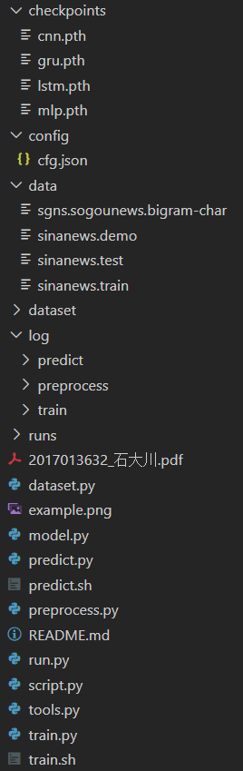

# 使用说明

#### 实验环境

* OS: Win10
* GPU: GTX 1070
* Python: 3.7
* 相关依赖：做的时候没开虚拟环境，用到的包在主流的pip/conda源应该都是可以找到的。

#### 用法

* 将实验数据(```sinanews.train```和```sinanews.test```)置于根目录的```./data```文件夹下
* 下载[Word2Vec](https://pan.baidu.com/s/1svFOwFBKnnlsqrF1t99Lnw)模型并解压后置于根目录的```./data```文件夹下

* 数据预处理

  ```bash
  python dataset.py
  ```

  数据预处理得到的结果会存在```./dataset```文件夹下

* 模型训练

  ```bash
  python run.py --model mlp --mode train -l 0.01 -b 64 -e 100 --gpu-id 0
  python run.py --model cnn --mode train -l 0.01 -b 64 -e 100 --gpu-id 0
  python run.py --model lstm --mode train -l 0.01 -b 64 -e 100 --gpu-id 0
  python run.py --model gru --mode train -l 0.01 -b 64 -e 100 --gpu-id 0
  ```

  其中：

  * ```model```指定模型
  * ```mode```指定训练或者预测
  * ```l```指定学习率
  * ```b```指定batch size
  * ```e```指定epochs数目
  * ```gpu-id```指定使用的gpu

  模型训练的日志文件会存在```./log/train```和```./runs```文件夹下

* 模型预测

  ```bash
  python run.py --model mlp --mode predict -b 64 --gpu-ids 0
  python run.py --model cnn --mode predict -b 64 --gpu-ids 0
  python run.py --model lstm --mode predict -b 64 --gpu-ids 0
  python run.py --model gru --mode predict -b 64 --gpu-ids 0
  ```

  其中：

  * ```model```指定模型
  * ```mode```指定训练或者预测
  * ```b```指定batch size
  * ```gpu-id```指定使用的gpu

  模型预测的日志文件会存在```./log/predict```文件夹下

  此外需要注意的是请确保```./checkpoints```文件夹下已经有训练好的模型后再进行预测

* 查看模型训练过程的loss和metrics图表以及模型网络结构

  ```bash
  tensorboard --logdir=runs
  ```

一个完整的项目结构应当类似于：

